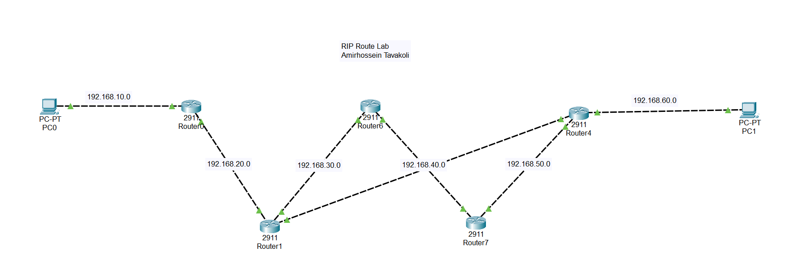

# RIP Dynamic Routing Lab — 5 Routers

> **Author:** Amirhossein Tavakoli  
> **Tool:** Cisco Packet Tracer  
> **Level:** Intermediate  

---

## 📋 Overview

This lab demonstrates dynamic routing using RIP (Routing Information Protocol) across a network of 5 Cisco 2911 routers. RIP automatically discovers and shares routing information between routers, enabling full end-to-end connectivity without static routes.

---

## 🖧 Topology



---

## 🎯 Objectives

- Configure RIP on 5 interconnected Cisco 2911 routers
- Advertise all directly connected networks via RIP
- Verify routing table population on all routers
- Test end-to-end connectivity between PC0 and PC1

---

## 🔧 Devices Used

| Device | Model | Networks |
|--------|-------|---------|
| Router0 | Cisco 2911 | 192.168.10.0, 192.168.20.0 |
| Router1 | Cisco 2911 | 192.168.20.0, 192.168.30.0 |
| Router6 | Cisco 2911 | 192.168.30.0, 192.168.40.0 |
| Router7 | Cisco 2911 | 192.168.40.0, 192.168.50.0 |
| Router4 | Cisco 2911 | 192.168.50.0, 192.168.60.0 |
| PC0 | PC-PT | 192.168.10.0 network |
| PC1 | PC-PT | 192.168.60.0 network |

---

## ⚙️ Key Configurations

### Interface IP Assignment (Router0 example)
```bash
Router(config)# interface GigabitEthernet 0/0
Router(config-if)# ip address 192.168.10.1 255.255.255.0
Router(config-if)# no shutdown

Router(config)# interface GigabitEthernet 0/1
Router(config-if)# ip address 192.168.20.1 255.255.255.0
Router(config-if)# no shutdown
```

### RIP Configuration
```bash
Router(config)# router rip
Router(config-router)# version 2
Router(config-router)# no auto-summary
Router(config-router)# network 192.168.10.0
Router(config-router)# network 192.168.20.0
```

---

## ✅ Verification Commands

```bash
Router# show ip route
Router# show ip rip database
Router# show ip protocols
Router# ping 192.168.60.1
```

---

## 🌐 Network Addressing

| Network | Subnet Mask | Connected Devices |
|---------|-------------|-------------------|
| 192.168.10.0 | 255.255.255.0 | PC0, Router0 |
| 192.168.20.0 | 255.255.255.0 | Router0, Router1 |
| 192.168.30.0 | 255.255.255.0 | Router1, Router6 |
| 192.168.40.0 | 255.255.255.0 | Router6, Router7 |
| 192.168.50.0 | 255.255.255.0 | Router7, Router4 |
| 192.168.60.0 | 255.255.255.0 | Router4, PC1 |

---

## 📁 Files

| File | Description |
|------|-------------|
| `rip-routing-lab.pkt` | Cisco Packet Tracer project file |
| `topology.png` | Network topology diagram |

---

## 📚 Concepts Covered

- Dynamic routing vs static routing
- RIP v2 configuration
- Route advertisement and convergence
- Routing table analysis

---

> 📘 Course reference: [Tosinso](https://tosinso.com) — CCNA Track
